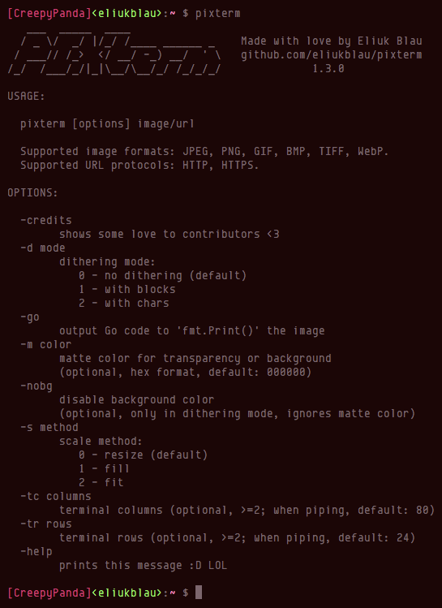
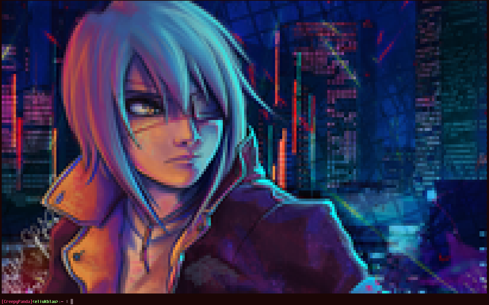
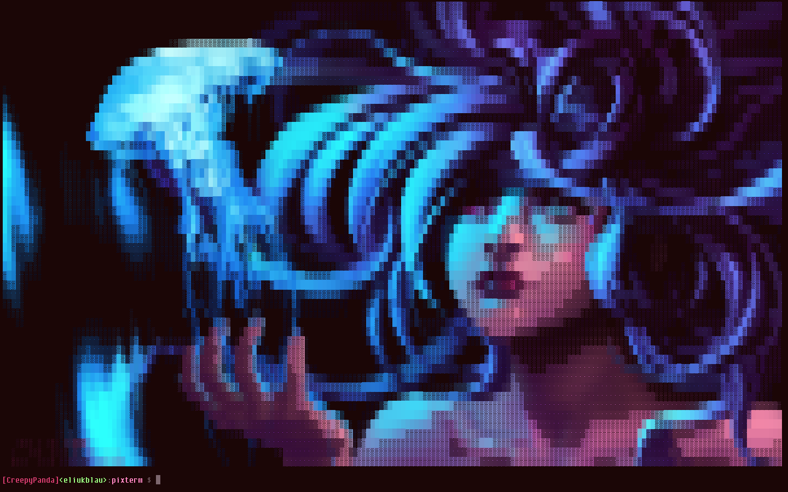
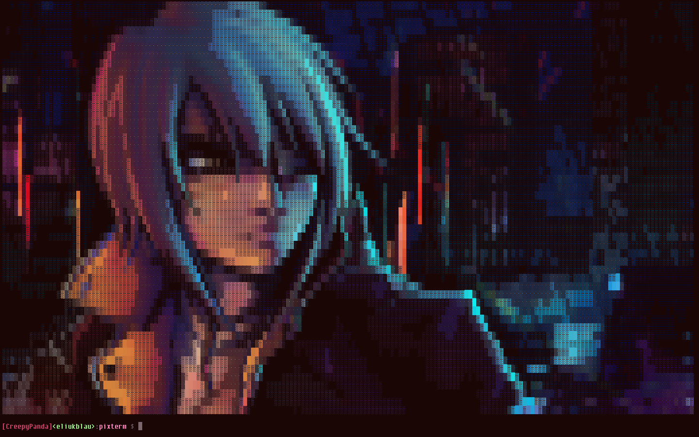
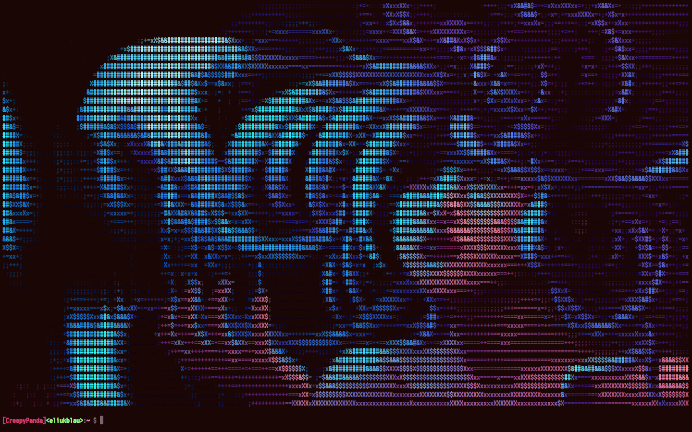
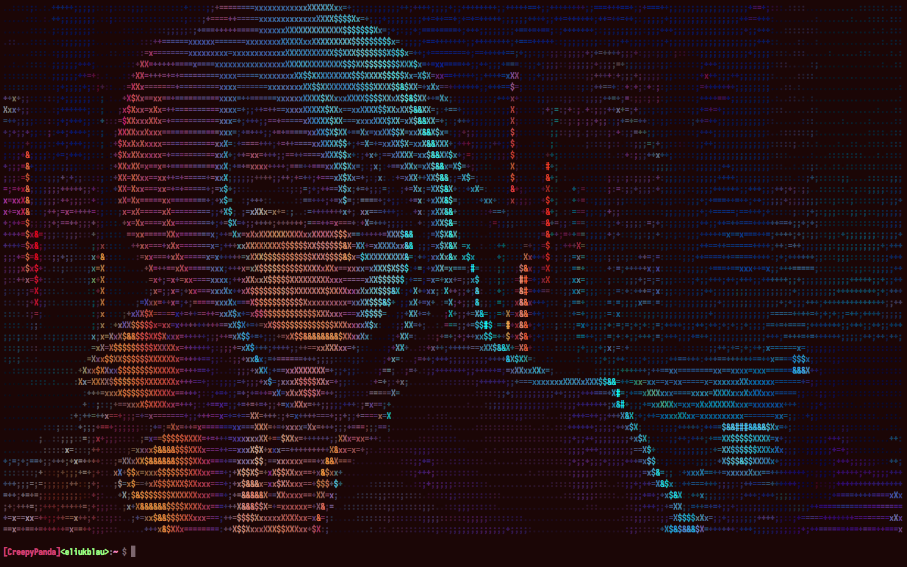
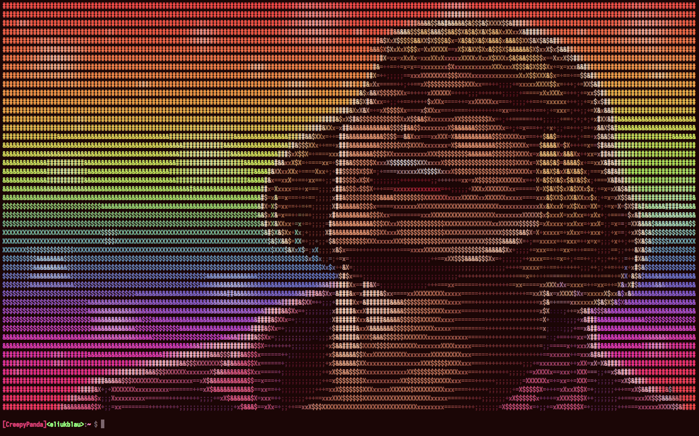
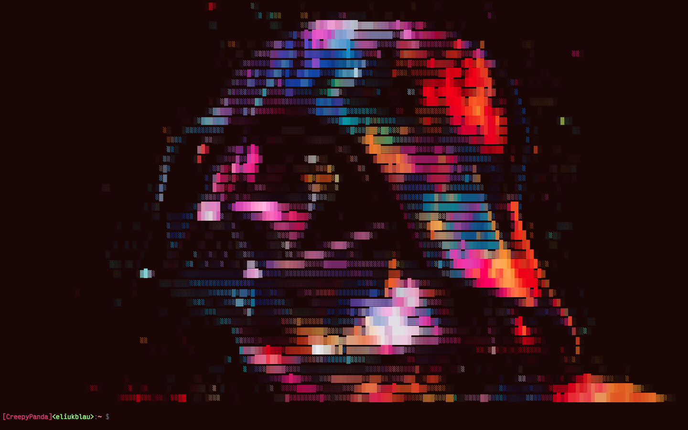
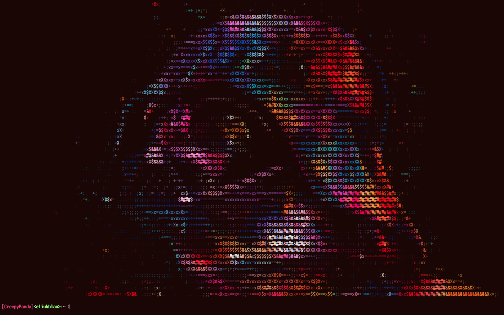

```
   ___  _____  ____
  / _ \/  _/ |/_/ /____ ______ _      Made with love by Eliuk Blau
 / ___// /_>  </ __/ -_) __/  ' \ https://github.com/eliukblau/pixterm
/_/  /___/_/|_|\__/\__/_/ /_/_/_/                1.3.2-preview

```

# `PIXterm` - *draw images in your ANSI terminal with true color*

**`PIXterm`** ***shows images directly in your terminal***, recreating the pixels through a combination of [ANSI character background color](https://en.wikipedia.org/wiki/ANSI_escape_code#Colors) and the [unicode lower half block element](https://en.wikipedia.org/wiki/Block_Elements). If image has transparency, an optional matte color can be used for background. Also, you can specify a dithering mode; in which case, the image is rendered using block elements with different shades, or using standard ASCII characters in the same way. In dithering mode, the matte color is used to fill the background of the blocks or characters.

The conversion process runs fast because it is parallelized in all CPUs.

Supported image formats: JPEG, PNG, GIF, BMP, TIFF, WebP.

Fetching images from HTTP/HTTPS is supported too.

#### Cool Screenshots



##### No Dithering (Classic Mode)





##### Dithering with Blocks






##### Dithering with Characters







##### Dithering with Background Color Disabled (`-nobg`)





#### Requirements

Your terminal emulator must be support *true color* feature in order to display image colors in a right way. In addition, you must use a monospaced font that includes the lower half block unicode character: `▄ (U+2584)`. I personally recommend [Envy Code R](https://damieng.com/blog/2008/05/26/envy-code-r-preview-7-coding-font-released). It's the nice font that shows in the screenshots. If you want to use the dithering mode with blocks, the font must also includes the following unicode characters: `█ (U+2588)`, `▓ (U+2593)`, `▒ (U+2592)`, `░ (U+2591)`. The dithering mode with characters works with standard ASCII chars.

#### Dependencies

All dependencies are included via standard [Go module system](https://blog.golang.org/using-go-modules). You should not do anything else.

###### Dependencies for `PIXterm` CLI tool

- Package [colorful](https://github.com/lucasb-eyer/go-colorful): `github.com/lucasb-eyer/go-colorful`
- Package [terminal](https://godoc.org/golang.org/x/crypto/ssh/terminal): `golang.org/x/crypto/ssh/terminal`

###### Dependencies for `ANSImage` Package

- Package [colorful](https://github.com/lucasb-eyer/go-colorful): `github.com/lucasb-eyer/go-colorful`
- Package [imaging](https://github.com/disintegration/imaging): `github.com/disintegration/imaging`
- Package [webp](https://godoc.org/golang.org/x/image/webp): `golang.org/x/image/webp`
- Package [bmp](https://godoc.org/golang.org/x/image/bmp): `golang.org/x/image/bmp`
- Package [tiff](https://godoc.org/golang.org/x/image/tiff): `golang.org/x/image/tiff`

#### Installation

*You need the [Go compiler](https://golang.org) version 1.20 or superior installed in your system.*

Run this command to automatically download sources and install **`PIXterm`** binary in your `$GOPATH/bin` (or `$GOBIN`) directory:

`go get -u github.com/eliukblau/pixterm/cmd/pixterm`

If you use Arch Linux, `eigengrau` has kindly created an AUR package for **`PIXterm`** (thanks man!). Run this command to install it:

`yaourt -S pixterm-git`

#### About

**`PIXterm`** is a terminal toy application that I made to exercise my skills on Go programming language. If you have not tried this language yet, please give it a try! It's easy, fast and very well organized. You'll not regret 😜

*This application is originaly inspired by the clever [termpix](https://github.com/hopey-dishwasher/termpix), implemented in [Rust](https://www.rust-lang.org).*

*The dithering mode is my own port of the [Processing Textmode Engine](https://github.com/no-carrier/ProcessingTextmodeEngine)'s render.*

#### License

[Mozilla Public License Version 2.0](https://mozilla.org/MPL/2.0)

#### Contributors

- [@disq](https://github.com/disq)
  - Original code for image transparency support.

- [@timob](https://github.com/timob)
  - Fix for `ANSIpixel` type: use 8bit color component for output.

- [@HongjiangHuang](https://github.com/HongjiangHuang)
  - Original code for image download support.

- [@brutestack](https://github.com/brutestack)
  - Color support for Windows (Command Prompt & PowerShell).
  - Original code for disable background color in dithering mode.
  - Original code for output Go code to `fmt.Print()` the image.

- [@diamondburned](https://github.com/diamondburned)
  - `NewFromImage()` & `NewScaledFromImage()` for `ANSImage` API.

- [@MichaelMure](https://github.com/MichaelMure)
  - More conventional `go.mod` file at repository.

- [@Calinou](https://github.com/Calinou)
  - Use HTTPS URLs everywhere.
  - Other awesome contributions.
